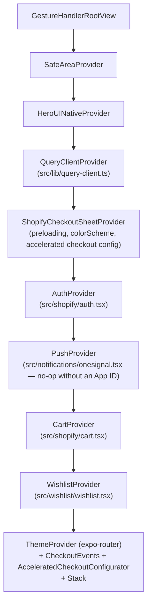
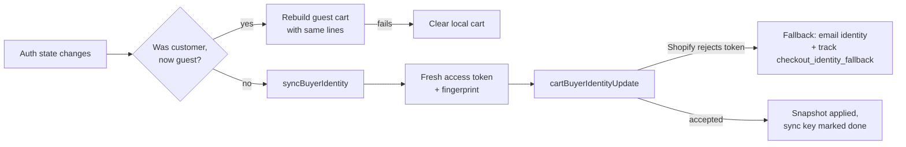

# Architecture

How the pieces fit together: the provider tree, how data flows from Shopify to
a screen, the cart's concurrency model, the checkout flow, auth, and the
pattern every optional integration follows.

## Provider tree

`src/app/_layout.tsx` mounts providers in this order (outermost first). The
order matters in a few places, noted below.



- `AuthProvider` sits above `CartProvider` because the cart reads
  `useAuth()` to resolve buyer identity (see [Cart state machine](#cart-state-machine)).
- `CheckoutEvents` (clears the cart and navigates on checkout `completed`) and
  `AcceleratedCheckoutConfigurator` (keeps wallet-button config in sync with
  sign-in state) are mounted as siblings of the `Stack`, inside every provider
  they depend on, so they stay alive across route changes.
- `ShopifyCheckoutSheetProvider`'s `configuration` prop is only read **once**,
  above `AuthProvider` — it can't itself react to sign-in/out. That's why
  accelerated checkout needs the separate `AcceleratedCheckoutConfigurator`
  component to re-push `acceleratedCheckouts.customer` via `checkout.setConfig()`
  whenever auth state changes.
- The root `ErrorBoundary` (exported from the same file) renders **outside**
  most of this tree — only inside `SafeAreaProvider` + `HeroUINativeProvider`
  — since a crash may have happened in any provider below it.
- `initializeTheme()`, `initMonitoring()`, and `initQueryLifecycle()` run once
  at module scope (before the component tree exists), not inside a provider.

## Data flow

```
Storefront API / mock.shop
        │  storefront<T>(operationText, variables)   ← src/shopify/client.ts
        ▼
React Query hooks (src/shopify/hooks.ts, customer.ts)
  queryFn calls storefront(), variables spread inContextVariables()
        ▼
Screens (src/app/**) — useQuery / useInfiniteQuery, select-mapped shapes
```

**Storefront client** (`src/shopify/client.ts`): `storefront()` is the single
entry point every hook and the cart use. It branches on `isDemoStore`
(`src/shopify/env.ts`):

- **Demo transport** — plain `fetch` POSTs to `https://mock.shop/api`, after
  `stripInContextDirective()` removes `@inContext(...)` and its `$country`/
  `$language` variables (mock.shop's schema doesn't support every directive a
  configured store's queries may use).
- **Real client** — `@shopify/storefront-api-client`, created **lazily** on
  the first non-demo request (`getStorefrontClient()`), so a blank/invalid
  domain — e.g. `npx expo export` with no `.env` — never throws at import
  time.

Both paths return the same `{ data, errors }` shape; `storefront()` throws
only when there's no data at all (partial data with field-level errors is
returned, with a `console.warn`).

**React Query hooks → screens**: `src/shopify/hooks.ts` defines one hook per
screen's data need (`useShop`, `useCollections`, `useCollection`, `useProduct`,
`useProductRecommendations`, `usePredictiveSearch`, `useSearchProducts`,
`useWishlistProducts`). Every catalog query spreads
`...inContextVariables()` from `src/shopify/locale.ts` into its variables, so
Markets localization is opt-in per query but consistent across the app.
`productQueryOptions(handle)` is exported separately from `useProduct` so a
product card can `queryClient.prefetchQuery(productQueryOptions(handle))` on
`onPressIn`, landing on the PDP with data already warm.

## Cart state machine

The cart (`src/shopify/cart.tsx`, concurrency primitives in
`src/shopify/cart-operations.ts`) is the most concurrency-sensitive part of
the app: a shopper can tap "add", change a quantity, and remove a line in
quick succession, and the cart must never show a client-local guess that
disagrees with what Shopify actually holds — and never mixes one customer's
cart with the previous signed-in customer's.

- **`CartSnapshotSequencer`** — every mutation (and rehydration/refresh) calls
  `begin()` for a monotonically increasing version token before its network
  call, and the response is only applied via `accept()` if no newer version
  has already landed. `invalidate()` bumps a `generation` counter so in-flight
  work from before a hard reset (sign-out) is dropped outright, not just
  out-of-order.
- **`QuantityUpdateQueue`** — quantity taps on the same line are coalesced per
  `lineId`: a burst of taps only ever has one write in flight, and the queue
  keeps re-sending the *latest* desired quantity until it matches what was
  last sent, so the final state always reflects the last tap, not whichever
  request happened to land first.
- **`CartIdPersistenceCoordinator`** — serializes writes to the durable
  `AsyncStorage` cart id so overlapping mutations (e.g. cart creation racing a
  sign-out reset) can't leave a stale or half-written id on disk.
- **Buyer identity sync** — `resolveBuyerIdentityTarget()` (pure, unit-tested)
  turns auth state into `{ kind: 'guest' | 'customer', countryCode }`.
  `syncBuyerIdentity()` fetches a **fresh** access token per call (tokens
  rotate on silent refresh), and the synchronization key it checks against
  includes `fingerprintToken(token)` — a short, non-reversible FNV-1a hash —
  so a rotated token is detected and re-synced without ever putting the raw
  token in a state key, log, or persisted value. If Shopify rejects the
  token (`userErrors`), the cart **falls back to the email-based identity**
  so checkout still works, tracked once as `checkout_identity_fallback`.
- **Sign-out privacy** — when the buyer-identity target transitions
  `customer → guest`, `CartProvider` rebuilds a **new guest cart** with the
  same lines (reusing the stale-cart recovery path) and drops the old cart id,
  guarded by the same snapshot sequencer as every other mutation. If the
  rebuild itself fails (e.g. offline), the local cart is cleared instead —
  privacy wins over keeping the items.



## Checkout flow

`useCheckout()` (`src/shopify/checkout.tsx`) is the single source of truth for
"can I check out right now":

1. **Preload** — as soon as the cart has a `checkoutUrl`, it's passed to
   `checkout.preload(url)` so presentation is instant later.
2. **Sync identity** — `startCheckout()` is gated by `buyerIdentityReady`
   (cheap, key-based check); the moment the shopper taps checkout,
   `prepareAndPresent()` calls `syncBuyerIdentity()` **again** with a fresh
   token immediately before `checkout.present(url)`, so the sheet is never
   opened with a stale or expired signed-in identity.
3. **Present** — a `CheckoutPresentationGuard` (`checkout-state.ts`) prevents
   presenting twice concurrently.
4. **Completion** — `handleCheckoutCompletion()` (shared by the regular sheet
   in `CheckoutEvents` and by `WalletCheckoutButtons`' accelerated-checkout
   completion, so both paths behave identically) tracks `purchase`, clears the
   local cart, and navigates to `/order-confirmed`.
5. **Expired / error recovery** — a `CheckoutExpiredError` triggers
   `recoverStaleCart()` (re-fetch, or recreate the cart from its last known
   lines if Shopify no longer has it) and reports whether recovery succeeded;
   any other sheet error surfaces a retryable message without touching the
   cart.

Accelerated checkout (`WalletCheckoutButtons`, opt-in, iOS 16+) renders Shop
Pay / Apple Pay buttons that skip the sheet entirely for a one-tap purchase,
but reuse the exact same completion path — see
[accelerated-checkout.md](accelerated-checkout.md).

## Auth

`src/shopify/auth.tsx` implements the Customer Account API's OAuth 2.0 + PKCE
flow for a mobile public client:

- **PKCE** — `AuthSession.AuthRequest` with `usePKCE: true`; the code verifier
  never leaves the device, only the resulting authorization code is exchanged
  server-side (`exchangeCodeAsync`).
- **Secure storage** — tokens (access, refresh, id) live in
  `expo-secure-store`, never `AsyncStorage`.
- **Refresh** — `getAccessToken()` returns the cached token when it has more
  than 60s left; otherwise it refreshes (`AuthSession.refreshAsync`) or, with
  no refresh token, falls through to sign-out.
- **Sign-out tombstone** — `clearCustomerSession()` writes a
  `storefront.customer.signed-out` marker to `AsyncStorage` *before* deleting
  the secure-store tokens, so a crash between those two writes still resolves
  to "signed out" on next launch (`loadTokens()` checks the tombstone first
  and deletes any leftover token). Every protected React Query cache entry is
  also cancelled and removed (`clearCustomerQueries`), analytics/monitoring
  identity is cleared, and OneSignal is unlinked.
- **Logout** — sign-out makes a **best-effort**, 5-second-timeout call to
  Shopify's Customer Account API end-session endpoint
  (`…/logout?id_token_hint=<idToken>`); it never blocks or fails local
  sign-out, which completes immediately either way.

## Optional integrations pattern

Every optional integration (Customer accounts, push, analytics, crash
reporting, accelerated checkout) follows the same two rules — see
[customization.md](customization.md#removing-an-integration-completely) for
how to remove one entirely:

1. **Env-gated no-op at the JS layer.** A module exports an `isXConfigured`
   boolean computed once from `process.env.EXPO_PUBLIC_*`, and every exported
   function checks it first and returns/no-ops when it's `false` — e.g.
   `isPushConfigured` in `src/notifications/onesignal.tsx`,
   `isMonitoringConfigured` in `src/lib/monitoring.ts`. Callers (screens,
   `_layout.tsx`) never branch on configuration themselves; they just call the
   module's exports unconditionally.
2. **Conditional config plugin at the native layer.** `app.config.ts` only
   appends a plugin entry (`onesignal-expo-plugin`,
   `@sentry/react-native/expo`) to the `plugins` array when its env var is
   set, so a template user who never configures OneSignal/Sentry never pays
   for their native code, permissions, or entitlements — and setting the var
   later requires a rebuild (documented per-integration), not a code change.
